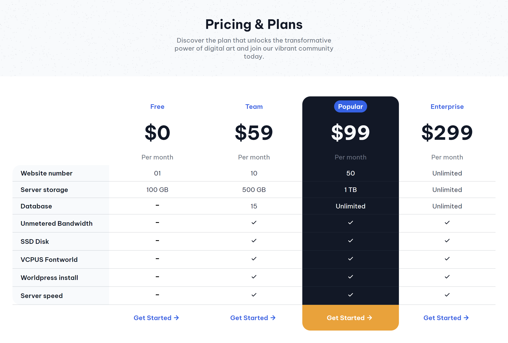

# Tabla de precios

Este es un proyecto de página de precios creado con **HTML** y **CSS**. La página muestra diferentes planes de suscripción, permitiendo a los usuarios comparar características y precios. El diseño es completamente responsive, asegurando una correcta visualización en diferentes tamaños de pantalla.

## Características

- **Planes visualmente atractivos**: Presenta diferentes opciones de suscripción con precios y características.
- **Responsive Design**: El diseño se adapta a dispositivos móviles y monitores de escritorio.
- **HTML semántico**: Estructura clara y accesible para mejorar la comprensión y la accesibilidad.
- **Diseño limpio y minimalista**: Uso de una paleta de colores suave y elementos visuales simples.
- **Uso de Google Fonts**: Fuentes modernas para una mejor apariencia tipográfica.

## Tecnologías Utilizadas

- **HTML**: Para la estructura de la página.
- **CSS**: Para el estilo y diseño visual del sitio.
- **Google Fonts**: Para las fuentes tipográficas.

## Vista Previa del Proyecto



## Cómo Ejecutarlo Localmente

1. Clona el repositorio:
    ```bash
    git clone https://github.com/tu-usuario/nombre-del-repositorio.git
    ```
2. Navega a la carpeta del proyecto:
    ```bash
    cd nombre-del-repositorio
    ```
3. Abre el archivo `index.html` en tu navegador.

## Estructura del Proyecto

```bash
/
├── index.html
├── style.css
├── img/
│   ├── dash.svg
│   ├── check-1.svg
│   ├── check.svg
│   ├── down arrow-1.svg
│   ├── down arrow.svg
│   └── sand-background-image.png
└── README.md
